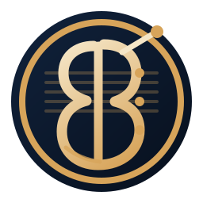

# Opciones de logo Bach

Estas propuestas buscan que `Back Orchestrator` se sienta mas editorial y menos generico, con una referencia clara a Johann Sebastian Bach desde tres angulos distintos.

Recomendacion inicial: `bach-option-score.svg`

Es la opcion mas equilibrada para producto porque mezcla partitura, gesto de direccion y una silueta util para icono de app.

## Opcion A · Maestro

Referencia: cameo barroco con peluca clasica, varita y pentagrama.

Uso ideal: splash screen, portada, marca con mas personalidad.

## Opcion B · Score

Referencia: partitura abierta con direccion musical y detalle barroco.

Uso ideal: icono principal de producto, favicon adaptado, header branding.

## Opcion C · Fuga

Referencia: monograma abstracto con movimiento de batuta y lineas de partitura.

Uso ideal: app icon mas moderno, sello tecnico, avatar de repositorio.

## Siguiente paso sugerido

Si eliges una opcion, el siguiente movimiento natural es:

1. Integrarla en el header de la app.
2. Convertirla al set de iconos de Tauri.
3. Preparar una variante monocroma para fondos oscuros y claros.
